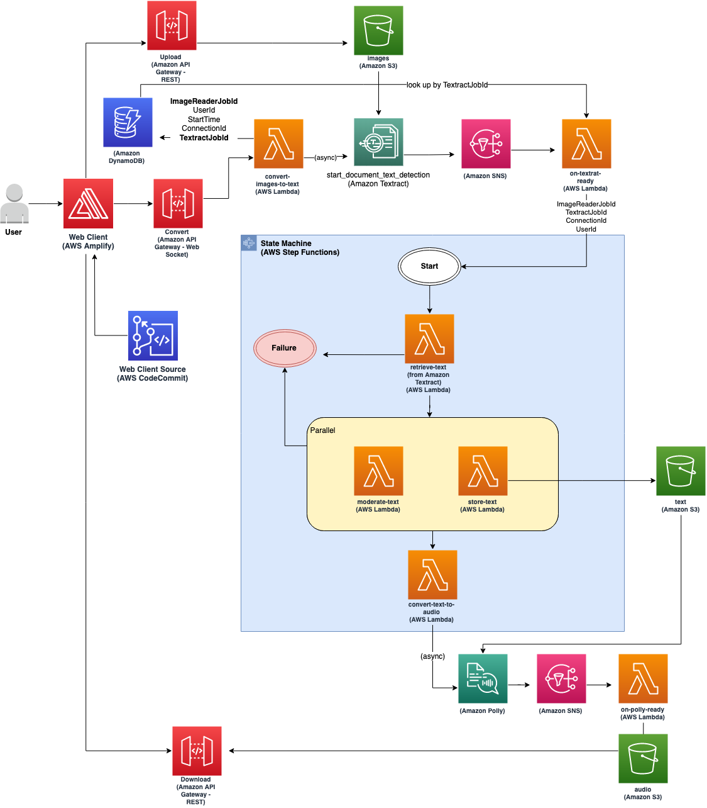

# Welcome to Scanned Documents to Speech project!

This project provides an end-to-end solution that converts scanned documents/images to speech, and reads back to user.

This is intended to be a demonstration implementation and is **not intended for production use without further modification**.



## Setup

Using [AWS Cloud9](https://aws.amazon.com/cloud9/) to build and deploy this project is **strongly recommended**.  Please follow [the instructions here](https://aws.amazon.com/cloud9/getting-started/) to create a AWS Cloud9 environment before continuing.

In Cloud9 IDE, start a new terminal (Window -> New Terminal) and follow these steps:

1. Clone this git repository and `cd` into the project directory.

2. Manually create a virtualenv:

    ```
    $ python3 -m venv .venv
    ```

3. After the init process completes and the virtualenv is created, use the following step to activate your virtualenv:

    ```
    $ source .venv/bin/activate
    ```

4. Once the virtualenv is activated, install the required dependencies:

    ```
    $ pip install -r requirements.txt
    ```

5. At this point you can now synthesize the CloudFormation templates from the CDK code.

    ```
    $ cdk synth
    ```

6. To deploy all stacks and capture CDK outputs needed later:

   ```
   $ cdk deploy --all --outputs-file cdk-outputs.json
   ```

7. To visit the web client, run the command below and follow the instructions printed to kick off frontend deployment and use the web client.
   ```
   $ ./extract-cdk-outputs.py cdk-outputs.json
   ```

8. To destroy everything:

    ```
    $ cdk destroy --all
    ```

To add additional dependencies, for example other CDK libraries, just add
them to your `setup.py` file and rerun the `pip install -r requirements.txt`
command.

## Useful commands

 * `cdk ls`          list all stacks in the app
 * `cdk synth`       emits the synthesized CloudFormation template
 * `cdk deploy`      deploy this stack to your default AWS account/region
 * `cdk diff`        compare deployed stack with current state
 * `cdk docs`        open CDK documentation

Enjoy!
